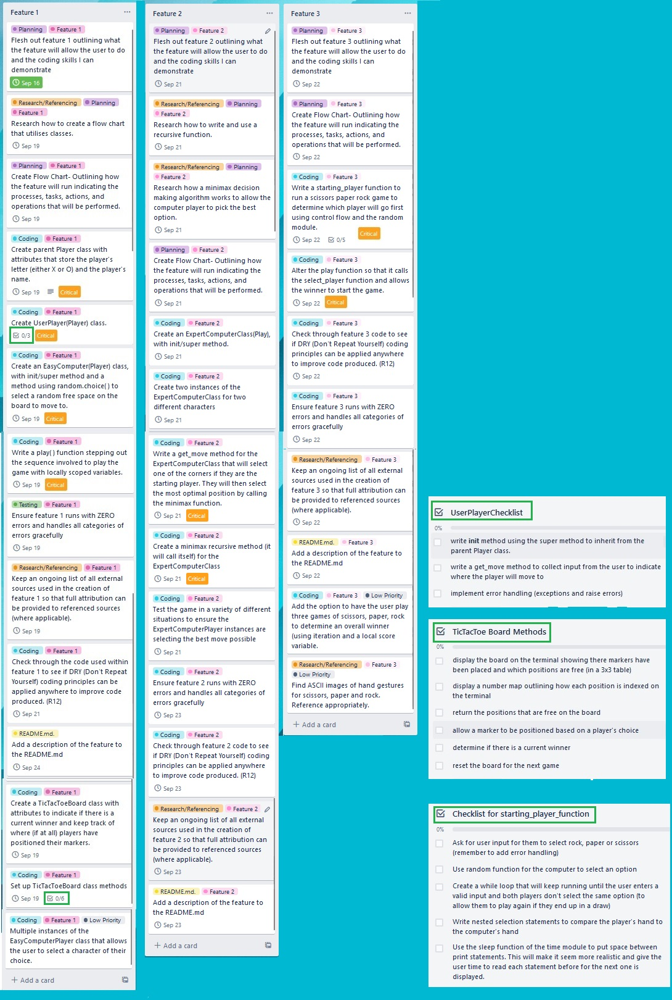
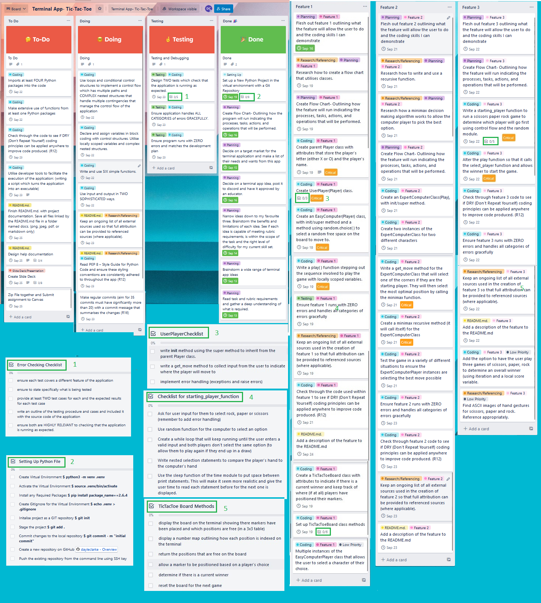
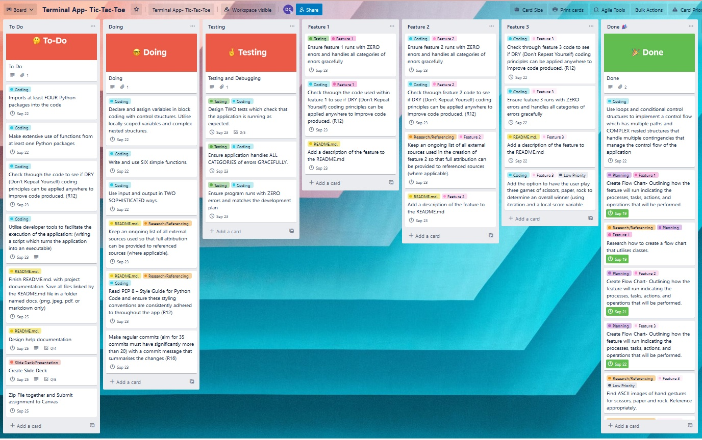
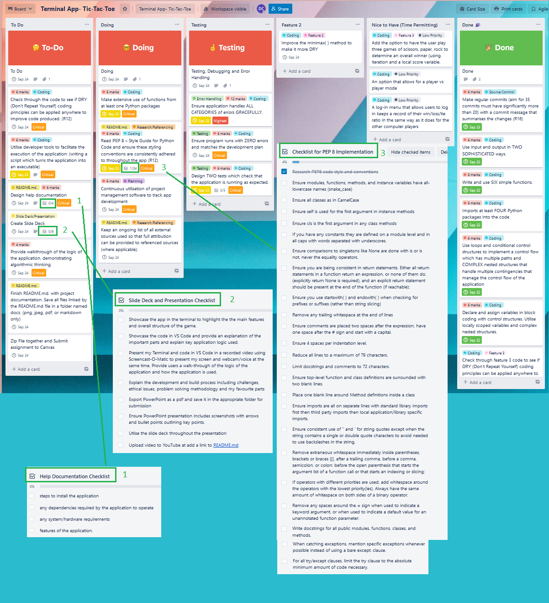
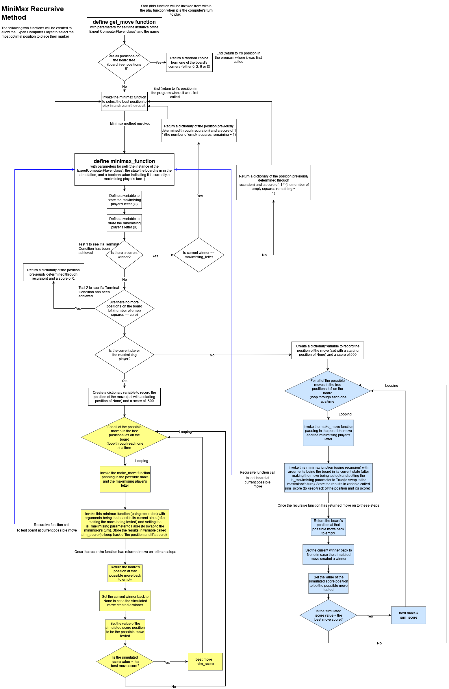
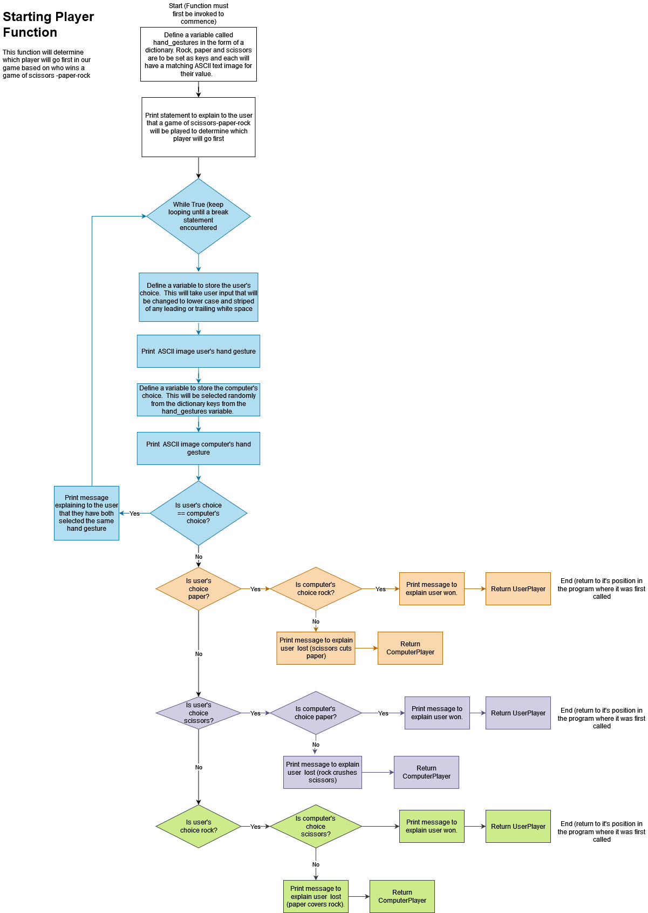
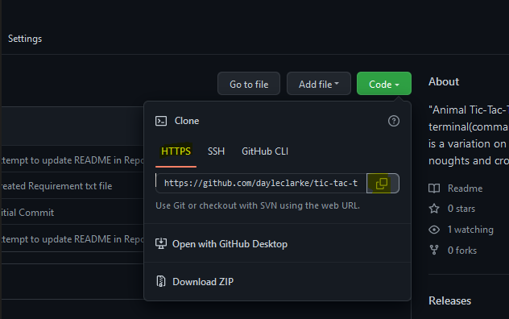

# Animal Tic-Tac-Toe 
---
## [Github Repo](https://github.com/dayleclarke/tic-tac-toe-terminal-app)
## [Source Control Repo](https://github.com/dayleclarke/tic-tac-toe-terminal-app/commits/main)
## [Trello Board Link](https://trello.com/invite/b/hD2rPgcC/98a0e6575fc9f7a34044f110c525874d/terminal-app-tic-tac-toe)
## [Video Link](https://youtu.be/W5GuhhKzXoE)
---

## Statement of Purpose and Scope

"Animal Tic-Tac-Toe” is a terminal(command line) application which is a variation on the classic Tic-Tac-Toe (or noughts and crosses) game.  In the game two players (one human user against one computer user) will take turns placing an X or O marker on a three-by-three grid.  The winner is whichever player is first to place three of their markers in a horizonal, vertical or diagonal row. If both players play optimally the game will end in a draw.

The purpose of this application is to demonstrate my ability to design, implement and test a terminal application and throughout the process demonstrate my ability to  use a range of developer tools. It was a mandatory requirement to accept user input and to either produce printed output or interact with a file system.

---
## Target Audience

The target market for this application is broad as it is a game that can be enjoyed by players of any age or gender. It is designed to be played by people who are somewhat tech savvy but haven't yet discovered the strategy to consistently win or tie the game.

---

## Features

### 1. An Easy mode Person vs. Environment (PvE)

The user can select to play on easy mode against a computer-controlled player.  The easy computer player will randomly select where to position their marker based on the free positions available on the board.  There are two easy computer players the user can select from: Pete the Panda or Katie the Koala.  

### 2. An Expert mode Person vs. Environment (PvE)

The user can select to play on expert mode against a computer-controlled player.  The expert computer player will select the optimal position to place their marker each time.  It is an unbeatable player which will either win or tie all games. When an expert play goes first it will position their marker in one of the corner positions. At all other times this player will invoke a recursive minimax function to return the optimal position based which position has the highest utility score (after testing all the possible free moves on the board).  There are two expert computer players the user can select from: Ollie the Octopus and Danni the Dolphin (both known to be highly intelligent animals).

### 3.  Game play order is determined by the outcome of a Scissor’s-Paper-Rock game

A game of scissors-paper-rock is played to determine which player will go first in the game.   Both players will simultaneously play either rock, paper, or scissors.  ASCII images of hands forming each of these gestures will be displayed. Rock (a closed fist) crushes scissors (two fingers forming a “V”), scissors cuts paper (a flat hand) and paper covers rock. In other words, rock wins against scissors, scissors win against paper and paper wins against rock.  The winner of scissors-paper-rock will be the first to place their marker. If both players make the same hand gesture than the game is repeated until a winner is determined. There is a distinct advantage to going first in Tic-Tac-Toe.

### 4. User Registration and Subsequent Log-In with data maintained in a csv file (user_credentials.csv)

A user log option allows the user to login using a unique login and set a password.  Passwords must be between 5 and 10 characters in length.  They also must contain at least one upper case and one lower case character as well as a number. Users will be required to confirm their password before it is added to the system. User log-in credentials are stored in a separate csv file allowing them to log in again next time they play the terminal application.  Having a unique username allows users to store their game play history (which is updated at the end of the game, refer to feature 5 below) to see their progress as they master the game.

When the app begins users are given the option to register as a new user, log in with an existing username if they are a returning player or to play as a guest.  Players who have forgotten their previous username or password are given the option to reregister or to play as a guest after three failed attempts at logging in.  

### 5. Game play data is maintained in a csv file (player_scores.csv)

This csv file records the win, loss, and tie history of each player (the user and each of the four computer players).  After each game scores are updated, and a new loss percentage ratio is calculated. At the end of each game the top 10 players (as calculated based on the total number of wins) are printed to the console.  Players who are playing as a guest (without logging in) will contribute to the guest player’s scores.

---

## Code Style Guide and Styling Conventions

For consistency and readability of code PEP8 styling conventions were applied consistently as outlined here [(Rossum, Warsaw, & Coghlan, 2022)](https://peps.python.org/pep-0008/).  The application has extended the maximum line length to 99 characters (but maintained all comments and docstrings are still wrapped at 72 characters. While PEP8 limits all lines to a maximum of 79 characters it provides the following exception by stating the following:
“Some teams strongly prefer a longer line length. For code maintained exclusively or primarily by a team that can reach agreement on this issue, it is okay to increase the line length limit up to 99 characters, provided that comments and docstrings are still wrapped at 72 characters.”

---
## Implementation Plan 

In order to complete this terminal application I utilised Trello to outline how each feature would be implemented and to create a prioritised checklist of tasks for each feature that needed to be completed. I made a list of all the tasks that were required, labelled each according to which feature it related to and added goals and deadlines for when I wanted these to be completed.  Tasks were also set as either critical, high, medium, and low priority. Figure 1-4 below shows what my Trello board looked throughout implementation. A copy of my Trello Board can be found here: [Trello Board Link](https://trello.com/invite/b/hD2rPgcC/98a0e6575fc9f7a34044f110c525874d/terminal-app-tic-tac-toe)

At the start of each day, I reviewed the implementation plan to see the most critical tasks to complete. Then at the end of the day I marked off the tasks that were completed and added any new tasks that were required. For example I added more items to the list (such as a checklist to ensure the correct implementation of PEP 8 style guide and a more detailed checklist for features 4 and 5.  The first three features of my application as outlined above were the only ones I had originally planned to include.  The user log-in and score tracking options were stretch goals/nice to have features that I achieved in the last two days of submitting the application.  
 

 Figure 1 and 2 below shows what my Trello board looked my on Friday the 16th September.  
 #### Figure 1: Trello Features Checklist Friday 16th September 2022



#### Figure 2: Trello Entire Board Friday 16th September 2022



#### Figure 3: Trello Entire Board Tuesday 20th September 2022



#### Figure 4: Trello Entire Board Thursday 22th September 2022



## Flow Charts

An important step in my implementation plan involved creating flow charts to outline how each feature would run indicating the processes, tasks, actions, and operations that would be performed.

Creating a flow chart was particularly important for implementing feature 2 (the expert computer player using a recursive minimax algorithm.  Figure 5 below shows a flow chart outlining the control flow and steps involved in the get_move() and minmax() methods of the ExpertComputerPlayer class that allow it to select the optimal move each time. 

A flow chart was also particularly helpful when implementing feature 3- (the game play order determined by the outcome of a Scissor’s-Paper-Rock game). The flow chart visually outlining the select_starting_player( ) function is shown in figure 6 below.  




## Installation Instructions

Currently, this terminal application is only supported on Linux and macOS (simple-term-menu is not compatible with Windows Terminal/Powershell).  Windows 10 users can still use the application but must run the app through the Windows Subsystem for Linux (WSL) (Ubuntu).
Windows Users Guide:

### Step 1: Open the terminal

If you are a Windows user without a WSL: Download and install Ubuntu 22.04 (or the latest version) WSL from the Microsoft Store

Once it installs it will prompt you to enter a username and password. This is for your Ubuntu environment.  It doesn't relate to your Windows username and password. Pick a username without spaces or special characters that is easy to type and remember. Choose a password you will remember (you’ll have to use it often to install tools).For detailed instructions see this documentation: [Using WSL instructions](https://janelbrandon.medium.com/a-guide-for-using-wsl-for-development-d135670313a6)

### Step 2: Check which version (if any) of Python you have installed and download/update Python if required.

#### Linux Systems 

Python is typically installed by default on most Linux systems. To check your current version, open a terminal and run the following command:

```bash
python --version
```

If you have a version less than 3.6 it is recommended that you update Python using the following commands:
```bash
sudo add-apt-repository ppa:deadsnakes/ppa
sudo apt-get update
sudo apt-get install python3.9 python3-pip
```

#### MacOS

On Mac the recommended way to install python is to use the official Python.org installer. Instructions for this can be found HERE: 
[macOS instructions](https://wsvincent.com/install-python/#install-python-on-macos)

### Step 3: Locate the folder where you would like to save the terminal application. Then when you are inside the folder Clone the repository from Github using the following command:

```bash
git clone https://github.com/dayleclarke/tic-tac-toe-terminal-app.git
```

This was created from the GitHub repository as shown here:


### Step 4: Open the folder that was cloned:
```bash 
cd tic-tac-toe-terminal-app
```
### Step 5: Run the following executable
```bash 
bash run_game.sh
```
This will automatically run the following bash script.  It will:
* check to ensure you have python 3 installed on your system and provide a warning message if that isn't the case. 
* Create a virtual environment using the standard name .venv.
* Activate the virtual environment
* Install all of the dependencies of the application stored within a seperate requirements.txt file.
* Run the python file
* Deactivate the virtual environment when the application is closed. 

```bash
#!/bin/bash
echo "Hello! Thank you for downloading this terminal application."
cd ./src;
if [[ -x "$(command -v python3)" ]]
then
    pyv="$(python3 -V 2>&1)"
    if [[ $pyv == "Python 3"* ]]
    then
        echo "You have the correct version of python installed."
    else
        echo "You have an outdated version of python. Please update your version of python." >&2
        
    fi 
else
    echo "You don't have python, please install it to run the application!" >&2
fi
echo "First I will create a virtual environment using the standard name .venv"
python3 -m venv .venv 
echo "Next I will activate the virtual environment"
source .venv/bin/activate
echo "Now I will install all of the dependencies of the application"
pip install -r ./requirements.txt
echo "Now we can run the python file"
python3 ./main.py
deactivate
```
### Dependencies


```
attrs==22.1.0
black==22.8.0
clearing==1.0.0
click==8.1.3
colorama==0.4.5
iniconfig==1.1.1
mypy-extensions==0.4.3
numpy==1.23.3
packaging==21.3
pandas==1.5.0
pathspec==0.10.1
platformdirs==2.5.2
pluggy==1.0.0
py==1.11.0
pyfiglet==0.8.post1
pyparsing==3.0.9
pytest==7.1.3
python-dateutil==2.8.2
pytz==2022.2.1
simple-term-menu==1.5.0
six==1.16.0
tomli==2.0.1
typing-extensions==4.3.0
```
### Testing


## Reference List
David Middlehurst. (2022). ASCII.co. Retrieved September 20, 2022, from OCTOPUS - ASCII ART: https://ascii.co.uk/art/octopus
Karlsson, V. (2022). Hand Gestures- Nonverbal Communication - Signals. Retrieved September 19, 2022, from Injosoft ASCII Art Archive: https://www.asciiart.eu/people/body-parts/hand-gestures
Kwasniewski, M. '. (2022). Dolphins. Retrieved September 20, 2022, from Injosoft ASCII Art Archive: https://www.asciiart.eu/animals/dolphins
lgbeard. (2022). Fireworks. Retrieved September 20, 2022, from Injosoft ASCII Art Archive: https://www.asciiart.eu/holiday-and-events/fireworks
Stark, J. G. (2022). Marsupials. Retrieved September 20, 2022, from Injosoft ASCII Art Archive: https://www.asciiart.eu/animals/marsupials
Stark, J. G. (2022). Pandas. Retrieved September 20, 2022, from Injosoft ASCII Art Archive: https://www.asciiart.eu/animals/dolphins


